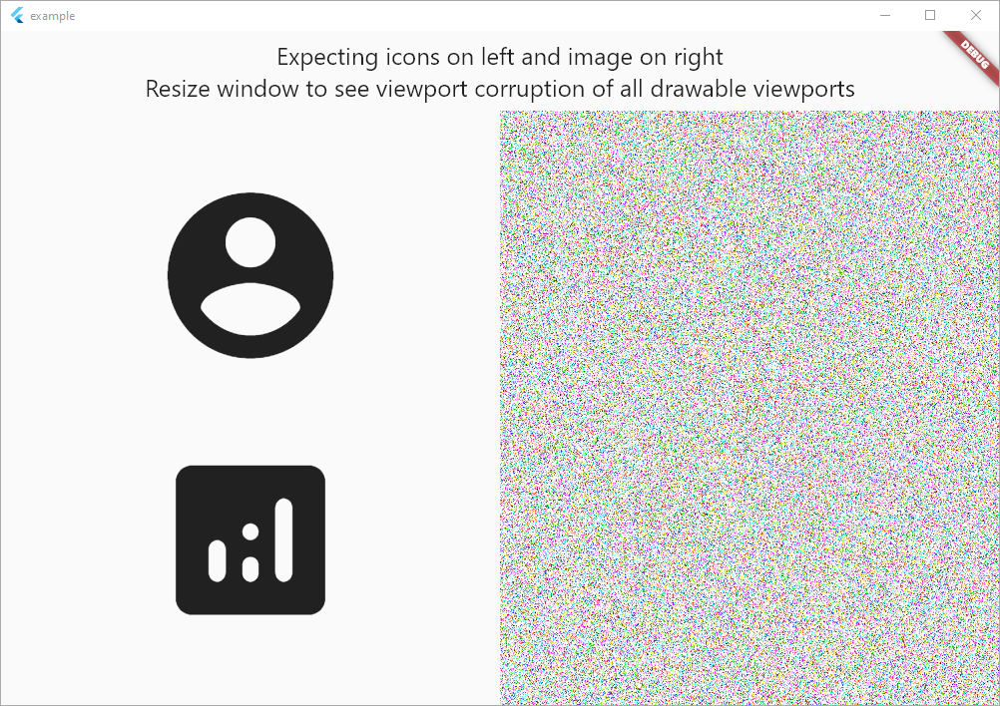
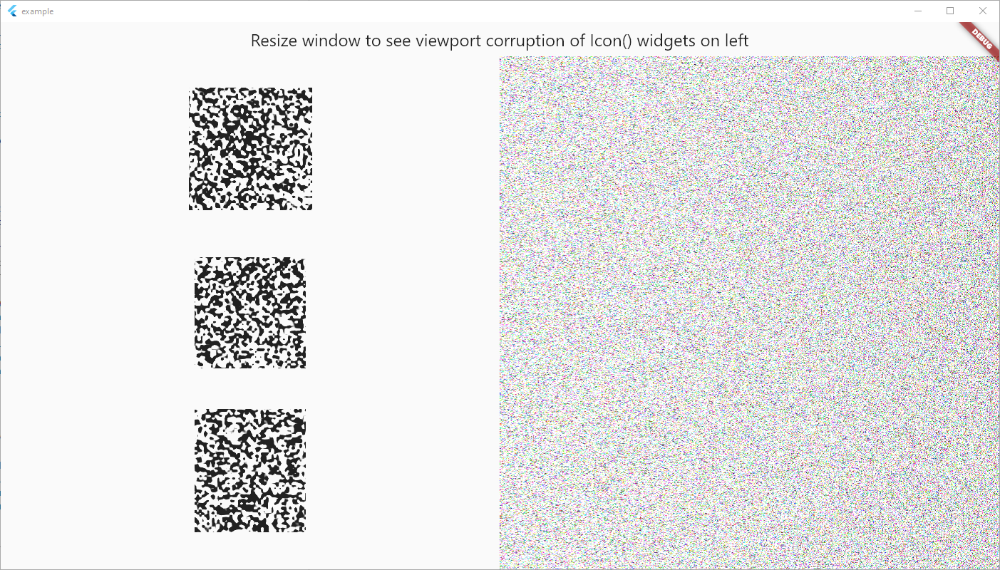

# Flutter Windows Texture Draw Bug

Shows off a viewport corruption bug with using Texture widget on Windows in
Flutter 2.1.0-12.1.pre.

See `example/lib/main.dart` for the reproduction case.

## Expected Result



## Actual Result



## Flutter Doctor

```sh
λ flutter doctor
Doctor summary (to see all details, run flutter doctor -v):
[√] Flutter (Channel dev, 2.1.0-12.1.pre, on Microsoft Windows [Version 10.0.19041.867], locale en-US)
[√] Android toolchain - develop for Android devices (Android SDK version 30.0.0)
[√] Chrome - develop for the web
[√] Visual Studio - develop for Windows (Visual Studio Community 2019 16.9.1)
[√] Android Studio (version 3.5)
[√] VS Code, 64-bit edition (version 1.54.3)
[√] Connected device (3 available)

• No issues found!
```
